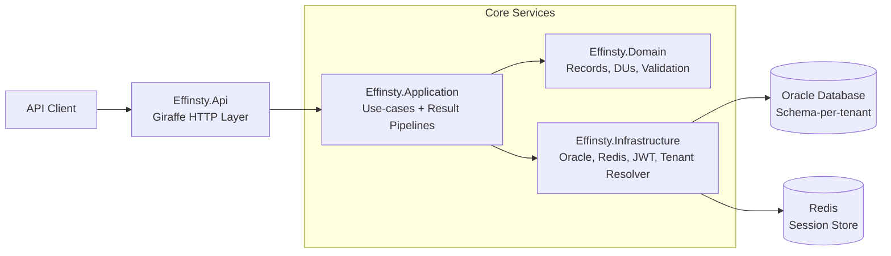
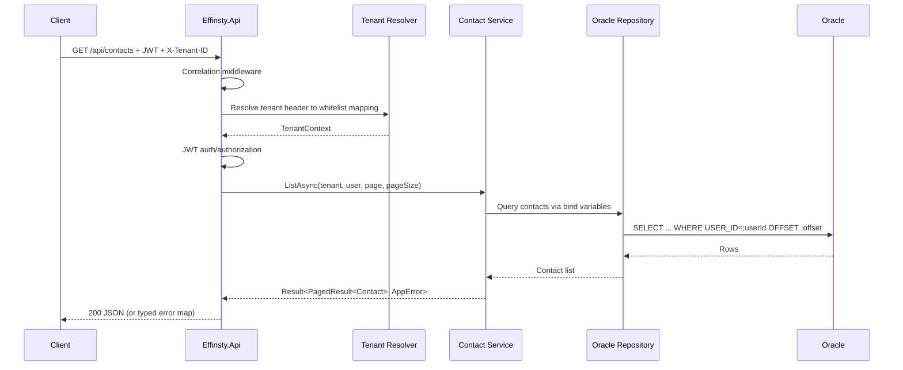
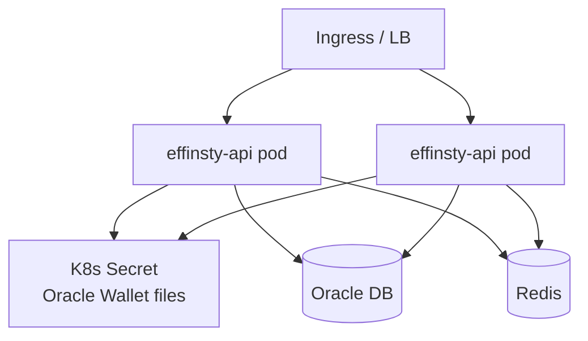

# Effinsty.Api

Functional-first F# backend using Giraffe, JWT auth, schema-per-tenant Oracle access (Wallet), Redis-backed sessions, and Dapper repositories.

## Architecture Graphics

### 1) Component Architecture



### 2) Request Flow (Authenticated Contact Endpoint)



### 3) Deployment Topology



## Project Layout

```text
src/
  Effinsty.Domain/         # Domain types, discriminated unions, validation
  Effinsty.Application/    # Interfaces + use-case services
  Effinsty.Infrastructure/ # Oracle/Dapper, Redis, JWT, tenant resolver
  Effinsty.Api/            # Giraffe HTTP entrypoint + handlers

tests/
  Effinsty.UnitTests/
  Effinsty.IntegrationTests/

k8s/
  deployment.yaml
  oracle-wallet-secret.example.yaml

docs/media/
  architecture.mmd
  request-flow.mmd
  deployment.mmd
```

## API Surface

### Auth
- `POST /api/auth/login`
- `POST /api/auth/refresh`
- `POST /api/auth/logout`

### Contacts
All `/api/contacts` endpoints require:
- `Authorization: Bearer <token>`
- `X-Tenant-ID: <tenant-id>`
- OAuth scope claim in the access token:
  - `contacts.read` for `GET /api/contacts` and `GET /api/contacts/{id}`
  - `contacts.write` for `POST /api/contacts`, `PUT /api/contacts/{id}`, and `DELETE /api/contacts/{id}`

Endpoints:
- `GET /api/contacts` (`contacts.read`)
- `GET /api/contacts/{id}` (`contacts.read`)
- `POST /api/contacts` (`contacts.write`)
- `PUT /api/contacts/{id}` (`contacts.write`)
- `DELETE /api/contacts/{id}` (`contacts.write`)

Example request headers:
```http
Authorization: Bearer <token>
X-Tenant-ID: tenant-a
```

### Health
- `GET /api/health`
- `GET /api/health/oracle`

## Run Locally

```bash
# prerequisites:
# - .NET SDK 10
# - Docker (for local Redis; optional for Oracle XE if you do not use remote Oracle)
# - Oracle wallet files if you target a remote Oracle environment

export DOTNET_CLI_HOME=/tmp/dotnet-home
export DOTNET_SKIP_FIRST_TIME_EXPERIENCE=1

# create .env (example)
cat > .env <<'EOF'
REDIS_URL=localhost:6379
ORACLE_WALLET_PATH=/oracle/wallet
TNS_ADMIN=/oracle/wallet
JWT_ISSUER=effinsty-api
JWT_AUDIENCE=effinsty-clients
JWT_SECRET=change-this-dev-secret-at-least-32-chars
TENANT_ID=tenant-a
TENANT_MAPPING_SCHEMA=TENANT_A
TENANT_MAPPING_DATASOURCE=mydb_high
EOF

# load .env
set -a
source .env
set +a

# map convenience vars to .NET configuration keys
export REDIS__CONFIGURATION="$REDIS_URL"
export JWT__ISSUER="$JWT_ISSUER"
export JWT__AUDIENCE="$JWT_AUDIENCE"
export JWT__SIGNINGKEY="$JWT_SECRET"

# seed minimal tenant mapping used by the app (user-secrets for local dev)
dotnet user-secrets --project src/Effinsty.Api/Effinsty.Api.fsproj set "Tenancy:Map:${TENANT_ID}:Schema" "$TENANT_MAPPING_SCHEMA"
dotnet user-secrets --project src/Effinsty.Api/Effinsty.Api.fsproj set "Tenancy:Map:${TENANT_ID}:DataSourceAlias" "$TENANT_MAPPING_DATASOURCE"

# start local Redis
docker run --rm -d --name effinsty-redis -p 6379:6379 redis:7-alpine

# for Oracle: run Oracle XE locally or point the wallet vars above to a reachable Oracle wallet/TNS setup

# build and run
dotnet restore Effinsty.Api.sln
dotnet build Effinsty.Api.sln
dotnet run --project src/Effinsty.Api/Effinsty.Api.fsproj
```

## Kubernetes Deploy Notes

`k8s/deployment.yaml` expects `${IMAGE_TAG}` substitution before apply.

```bash
IMAGE_TAG="$(git rev-parse --short HEAD)" envsubst < k8s/deployment.yaml | kubectl apply -f -
```

## Configuration

Do not commit secrets to `src/Effinsty.Api/appsettings.json`.

Use `appsettings.example.json`/`appsettings.Development.json`, `dotnet user-secrets`, or environment variables for:
- `Jwt:*`
- `Oracle:*`
- sensitive `Redis:*` values

Keep non-secret tenant routing values such as `Tenancy:Map:*` in tracked configuration (or set them via local user-secrets/env vars during development).

Oracle runtime settings should be provided via secret/config management, not committed paths:
- wallet path: `ORACLE_WALLET_PATH` (fallback `ORACLE_WALLET_LOCATION` [deprecated], then `WALLET_LOCATION`)
- TNS admin path: `ORACLE_TNS_ADMIN` (fallback `TNS_ADMIN`)
- data source alias: `ORACLE_DATA_SOURCE` (fallback `DATA_SOURCE`)
- alternatively use .NET config keys (`Oracle:WalletLocation`, `Oracle:TnsAdmin`, `Oracle:DataSource`) through user-secrets or environment variables (`Oracle__...`)

## Media

Reusable diagram sources are stored in:
- `docs/media/architecture.mmd`
- `docs/media/request-flow.mmd`
- `docs/media/deployment.mmd`

You can paste these into Mermaid-compatible tooling (GitHub, MkDocs, Mermaid Live) for PNG/SVG export.
