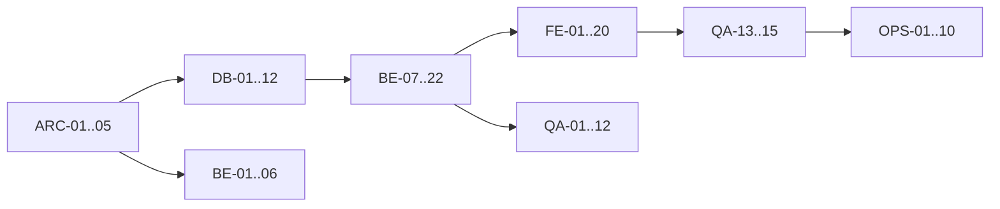

# Effinsty Form 720 Workmap
## Comprehensive Dependency-Wired Task List

**Version:** 1.0  
**Date:** 2026-03-16  
**Scope Sources:**
- `tests/Effinsty.IntegrationTests/dev.md`
- `docs/form720-backend-database-dev-spec.md`
- `frontend/frontend.md`

---

## 1. Workstream Key

- `ARC`: Architecture and planning
- `DB`: Oracle schema and migrations
- `BE`: Backend domain/application/infrastructure/API
- `FE`: Frontend UI/state/API integration
- `QA`: Test automation and quality gates
- `OPS`: DevOps, observability, runbooks, release

---

## 2. Phase Gates

- **Gate A (Design Ready):** ARC tasks complete
- **Gate B (Data Ready):** DB core migrations + repository contracts complete
- **Gate C (API Ready):** BE endpoints and contracts stable
- **Gate D (UI Ready):** FE routes and integration complete
- **Gate E (Release Ready):** QA + OPS checks complete

---

## 3. Dependency Graph (High-Level)

---

## 4. Comprehensive Task List

| ID | Workstream | Task | Depends On | Output | Exit Criteria |
|---|---|---|---|---|---|
| ARC-01 | ARC | Confirm source requirements baseline and exclusions | - | approved scope memo | Signed off by eng + product |
| ARC-02 | ARC | Define canonical status enums and transition matrix | ARC-01 | status matrix doc | No ambiguous transitions |
| ARC-03 | ARC | Define API contract naming, casing, and envelope rules | ARC-01 | API contract ADR | Approved by BE+FE |
| ARC-04 | ARC | Define tenant/org ownership model for returns | ARC-01 | data ownership model | Ownership checks documented |
| ARC-05 | ARC | Finalize milestone plan and staffing alignment | ARC-01, ARC-02, ARC-03, ARC-04 | delivery plan | Gate A complete |
| DB-01 | DB | Add migration `007_form720_core_tables.sql` | ARC-02, ARC-04 | organizations/returns/line-items/tx tables | Migration runs on clean schema |
| DB-02 | DB | Add migration `008_form720_indexes_partitioning.sql` | DB-01 | indexes + partition clauses | Explain plans show indexed paths |
| DB-03 | DB | Add migration `009_form720_audit_and_triggers.sql` | DB-01 | audit table/sequence/triggers | Audit rows generated on DML |
| DB-04 | DB | Add constraints for status/quarter/filing-type validity | DB-01 | check constraints | Invalid values rejected |
| DB-05 | DB | Add optimistic concurrency (`VERSION_NO`) support | DB-01 | versioned returns table | update conflict detectable |
| DB-06 | DB | Add uniqueness guard for active ORIGINAL return per org/year/quarter | DB-01, ARC-02 | unique index/constraint strategy | Duplicate create prevented |
| DB-07 | DB | Add DBA runbook notes for new migrations | DB-01, DB-02, DB-03 | migration runbook entries | DBA can execute end-to-end |
| DB-08 | DB | Add rollback/failure remediation SQL notes | DB-01, DB-03 | remediation script notes | rollback playbook reviewed |
| DB-09 | DB | Add seed/reference data migration if needed (`010_*`) | DB-01 | seed scripts | Seed re-runnable |
| DB-10 | DB | Add integration validation SQL checks for new objects | DB-01, DB-03 | object inventory checks | Checks pass in tenant schema |
| DB-11 | DB | Validate partition strategy against expected query patterns | DB-02 | query-performance note | acceptable plan for list/status |
| DB-12 | DB | Sign off database readiness | DB-04, DB-05, DB-06, DB-10, DB-11 | DB readiness report | Gate B complete |
| BE-01 | BE | Add new domain IDs and record types in `Types.fs` | ARC-02, ARC-04 | domain types | Builds and types compile |
| BE-02 | BE | Add domain validation rules for return/line-item payloads | BE-01, ARC-02 | validation functions | unit tests pass |
| BE-03 | BE | Add application contracts (`IReturnService`, etc.) | BE-01, ARC-03 | updated contracts | compile + interface tests |
| BE-04 | BE | Add command/query DTOs for returns workflows | BE-03 | command/query models | command validation wired |
| BE-05 | BE | Add IRS gateway abstraction interface (`IIrsFilingGateway`) | BE-03 | filing gateway interface | mockable in tests |
| BE-06 | BE | Extend error model and mapping for IRS/service errors | ARC-03, BE-03 | app + API error mapping | error codes stable |
| BE-07 | BE | Add SQL templates for returns list/get/create/update/delete | DB-12, BE-03 | SQL templates | SQL template tests pass |
| BE-08 | BE | Add SQL templates for line-item add/remove/list | DB-12, BE-03 | SQL templates | template tests pass |
| BE-09 | BE | Add SQL templates for filing transaction and audit retrieval | DB-12, BE-03 | SQL templates | template tests pass |
| BE-10 | BE | Implement repository row mappers for new entities | BE-07, BE-08, BE-09 | repository mappers | mapper tests pass |
| BE-11 | BE | Implement `IReturnRepository` in infrastructure layer | BE-10 | repository implementation | integration CRUD passes |
| BE-12 | BE | Implement return service create/update/delete rules | BE-04, BE-11, BE-02 | service methods | service unit tests pass |
| BE-13 | BE | Implement line-item add/remove and total recompute logic | BE-11, BE-12, BE-02 | service methods | totals match persisted data |
| BE-14 | BE | Implement validation workflow and status transitions | BE-12, BE-13, ARC-02 | validation service flow | transition matrix enforced |
| BE-15 | BE | Implement submit workflow with filing tx persistence | BE-05, BE-11, BE-14 | submit orchestration | submission path test passes |
| BE-16 | BE | Add API DTOs for returns endpoints | BE-04, ARC-03 | dto models | contract tests pass |
| BE-17 | BE | Add handlers for `/api/returns*` routes | BE-12, BE-13, BE-14, BE-15, BE-16 | handler module updates | endpoint tests pass |
| BE-18 | BE | Add route wiring and scope policies in `Program.fs` | BE-17 | route table + scopes | unauthorized/scope tests pass |
| BE-19 | BE | Add audit trail endpoint and mapping | BE-11, BE-17 | audit endpoint | timeline response test passes |
| BE-20 | BE | Add status polling endpoint and mapping | BE-15, BE-17 | status endpoint | status flow test passes |
| BE-21 | BE | Add backend telemetry/log enrichment for return lifecycle | BE-17 | structured logs/metrics tags | logs include correlation + return id |
| BE-22 | BE | Backend readiness signoff | BE-18, BE-19, BE-20, BE-21 | backend readiness report | Gate C complete |
| FE-01 | FE | Add return API module (`src/lib/api/returns.ts`) | BE-22, ARC-03 | api client methods | api unit tests pass |
| FE-02 | FE | Add return domain/service types (`returns.types.ts`) | FE-01, BE-22 | FE type contracts | type checks pass |
| FE-03 | FE | Add returns list controller + page route | FE-01, FE-02 | `/dashboard/returns` | page tests pass |
| FE-04 | FE | Add create return controller + page route | FE-01, FE-02 | `/dashboard/returns/new` | create flow test passes |
| FE-05 | FE | Add return detail page and summary UI | FE-01, FE-02 | `/dashboard/returns/[id]` | detail render tests pass |
| FE-06 | FE | Add return edit controller + page | FE-04, FE-05 | `/dashboard/returns/[id]/edit` | edit save tests pass |
| FE-07 | FE | Add line-item editor controller + page | FE-06, FE-01 | `/line-items` route | add/remove tests pass |
| FE-08 | FE | Add review page with validation panel | FE-06, FE-01 | `/review` route | validation UX tests pass |
| FE-09 | FE | Add audit trail page | FE-05, FE-01 | `/audit` route | audit render tests pass |
| FE-10 | FE | Add returns store (`returns.store.ts`) | FE-01, FE-02 | list/filter store | store tests pass |
| FE-11 | FE | Add return draft store (`return-draft.store.ts`) | FE-02, FE-06, FE-07 | draft state store | draft workflow tests pass |
| FE-12 | FE | Build return list components (table/status/filter) | FE-03, FE-10 | reusable list components | component tests pass |
| FE-13 | FE | Build line-item components (table/editor dialog) | FE-07, FE-11 | line-item components | component tests pass |
| FE-14 | FE | Build validation + submission timeline components | FE-08, FE-11 | validation/submission components | component tests pass |
| FE-15 | FE | Extend error mapping/presenter for new backend codes | FE-01, BE-06 | error presentation updates | error tests pass |
| FE-16 | FE | Add telemetry events for key return actions | FE-03, FE-04, FE-08, FE-15 | telemetry instrumentation | event snapshots pass |
| FE-17 | FE | Add responsive and accessibility fixes across new routes | FE-03, FE-04, FE-05, FE-06, FE-07, FE-08, FE-09 | a11y-hardening pass | axe tests pass |
| FE-18 | FE | Add route-level guards for scope-restricted actions | FE-01, FE-03, FE-08 | guarded UI actions | authorization UI tests pass |
| FE-19 | FE | Update docs and release runbook for returns flows | FE-16, FE-17 | docs updates | runbook reviewed |
| FE-20 | FE | Frontend readiness signoff | FE-12, FE-13, FE-14, FE-15, FE-17, FE-18, FE-19 | frontend readiness report | Gate D complete |
| QA-01 | QA | Add backend unit tests for validation + transitions | BE-14 | unit tests | CI pass |
| QA-02 | QA | Add repository integration tests for returns and line items | DB-12, BE-11 | integration tests | CI pass |
| QA-03 | QA | Add API contract lock tests for new DTO payloads | BE-16, BE-17 | contract tests | CI pass |
| QA-04 | QA | Add API auth/scope coverage tests for returns endpoints | BE-18 | auth tests | CI pass |
| QA-05 | QA | Add submit workflow tests (happy/failure/retry) | BE-15, BE-20 | workflow tests | CI pass |
| QA-06 | QA | Add frontend unit tests for stores/controllers | FE-10, FE-11, FE-03, FE-06, FE-08 | FE unit tests | CI pass |
| QA-07 | QA | Add frontend component tests for returns UI components | FE-12, FE-13, FE-14 | FE component tests | CI pass |
| QA-08 | QA | Add a11y tests for all new routes | FE-17 | axe coverage | CI pass |
| QA-09 | QA | Add E2E scenario: create->edit->validate->submit | FE-20, BE-22 | e2e scenario | pass in CI env |
| QA-10 | QA | Add E2E scenario: validation failure and correction | FE-20, BE-22 | e2e scenario | pass in CI env |
| QA-11 | QA | Add E2E scenario: authorization restrictions | FE-18, BE-18 | e2e scenario | pass in CI env |
| QA-12 | QA | Add non-functional checks for pagination/perf budgets | BE-22, FE-20 | perf checks | thresholds documented |
| QA-13 | QA | Test evidence collection and traceability matrix | QA-01, QA-02, QA-03, QA-04, QA-05, QA-06, QA-07, QA-08, QA-09, QA-10, QA-11, QA-12 | QA traceability pack | all requirements mapped |
| QA-14 | QA | Regression run across existing auth/contacts paths | QA-13 | regression report | no critical regressions |
| QA-15 | QA | Quality signoff for release candidate | QA-14 | QA signoff | Gate E prerequisite met |
| OPS-01 | OPS | Update CI pipelines for new backend/frontend test suites | QA-13 | CI config updates | pipelines green |
| OPS-02 | OPS | Add migration deployment stage for `007+` SQL files | DB-12, OPS-01 | deployment pipeline update | migrations applied in staging |
| OPS-03 | OPS | Add production rollout checklist for returns feature | OPS-02, FE-19, DB-07 | release checklist | checklist approved |
| OPS-04 | OPS | Add observability dashboards/alerts for returns workflow | BE-21, FE-16 | dashboard + alerts | alerts validated |
| OPS-05 | OPS | Add runbook for IRS submission failure handling | BE-15, BE-20 | incident runbook section | on-call walkthrough complete |
| OPS-06 | OPS | Staging deployment + smoke execution | OPS-03, QA-15 | staging verification report | no blocker defects |
| OPS-07 | OPS | Production change approval package | OPS-06 | CAB package | approval granted |
| OPS-08 | OPS | Production rollout | OPS-07 | deployed release | smoke checks pass |
| OPS-09 | OPS | Hypercare monitoring window and incident triage | OPS-08, OPS-04, OPS-05 | hypercare report | critical incidents resolved |
| OPS-10 | OPS | Post-release retrospective and backlog carryover | OPS-09 | retro actions | closeout complete |

---

## 5. Critical Path

1. `ARC-01 -> ARC-05`
2. `DB-01 -> DB-12`
3. `BE-07 -> BE-22`
4. `FE-01 -> FE-20`
5. `QA-09 -> QA-15`
6. `OPS-02 -> OPS-10`

Delays in `DB-12`, `BE-22`, or `FE-20` directly delay release.

---

## 6. Recommended Execution Sequence

1. Complete ARC + DB in parallel with early BE domain/contracts (`BE-01..06`).
2. Lock API contracts (`ARC-03`, `BE-16`) before FE controller implementation.
3. Build BE handlers and FE routes incrementally by vertical slices:
   - Slice A: create/list/get
   - Slice B: line-items + totals
   - Slice C: validate/submit/status/audit
4. Run QA continuously per slice, not at end-only.
5. Promote to staging only after Gate E criteria are met.
